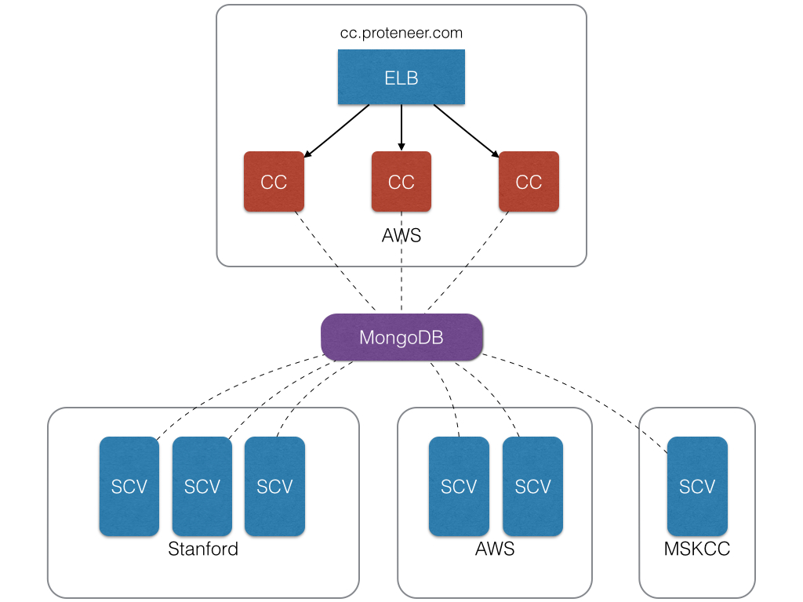
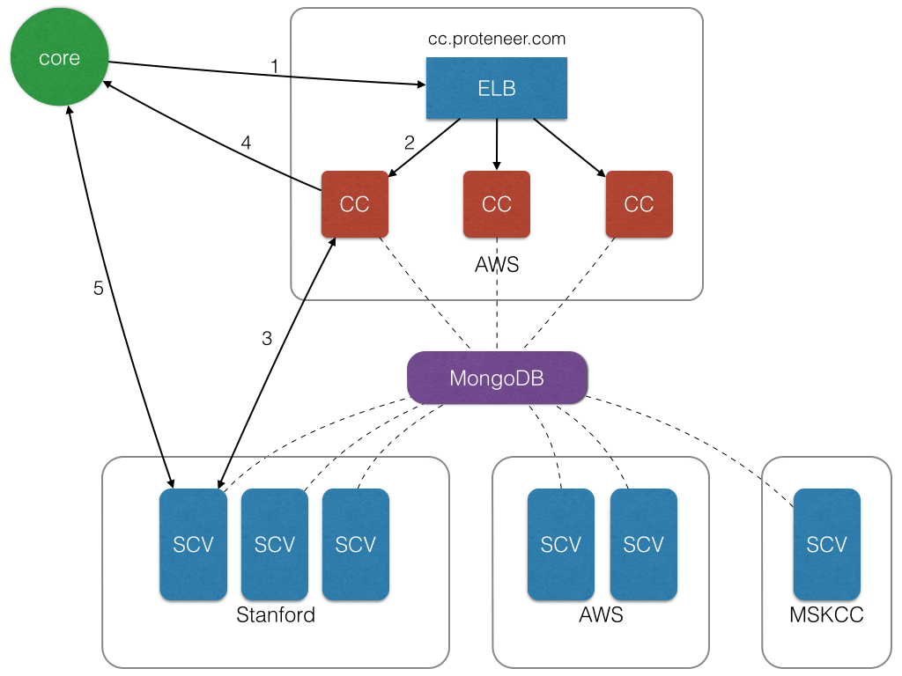
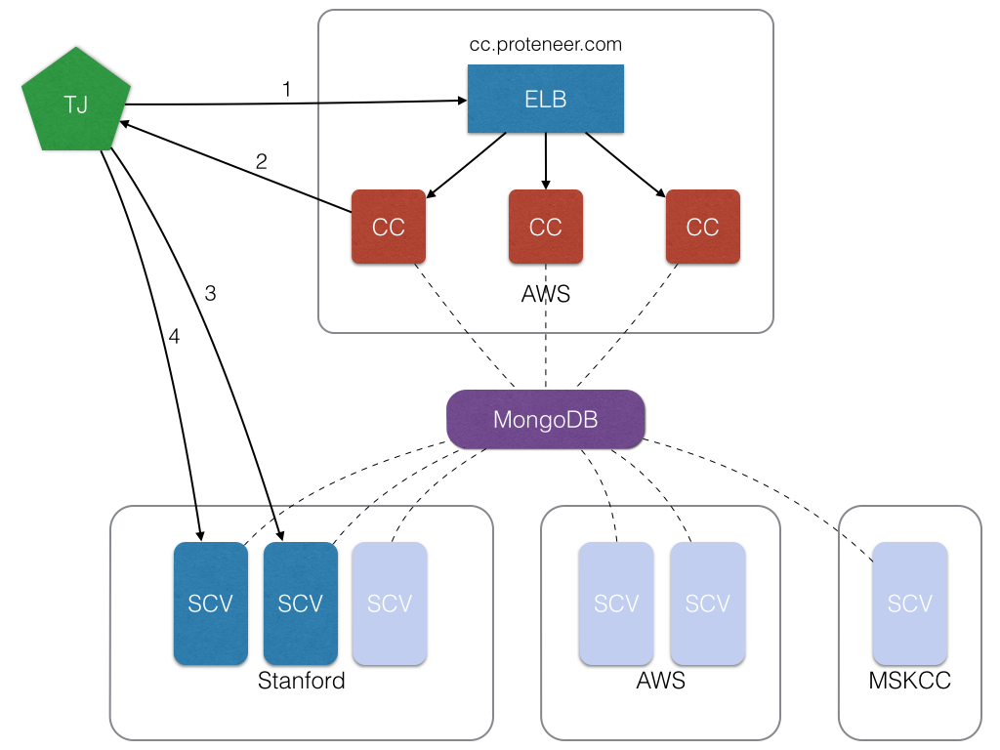

Architectural Overview
----------------------

CCs (Command Centers) serve the role of assignment servers in addition to other useful services. They provide REST APIs for many services such as adding managers, adding donors, adding targets, managing core assignments, etc. Typically in production environments, CCs are deployed behind AWS EC2 instances with requests routed via ELB. 

ELB (Elastic Load Balancer) allows for a single point of contact for all requests for CCs. In addition to load balancing, it also allows us to provide a single point of contact.

SCVs are workservers and do most of the heavy lifting. They typically demand large amounts of ram, disk space, and especially bandwidth. Targets typically shard their streams over a particular range of SCVs.

MongoDB is the persistent storage layer that stores information about the target as a whole. It also stores additional information such as statistics, managers, donors, servers (in separate databases). Both the CCs and SCVs are connected to MongoDB.

Core Assignments
----------------

1. A core begins by making an assignment request to cc.proteneer.com 
2. The request gets routed by the ELB to a particular CC depending on load.
3. The CC picks a target via an assignment algorithm. Once a target has been chosen, the CC picks an SCV the target is sharded over.
4. The CC then returns a token and URI back to the core. 
5. The core starts the stream  and submits frames, checkpoints, and heartbeats.

Adding New Targets
------------------

1. TJ adds a new target to cc.proteneer.com (ELB routes request to CC)
2. The CC adds the target and responds to the client with a 200 - OK
3. TJ adds a new stream for the specified target to an SCV.
4. TJ adds a new stream for the same target to a different SCV.